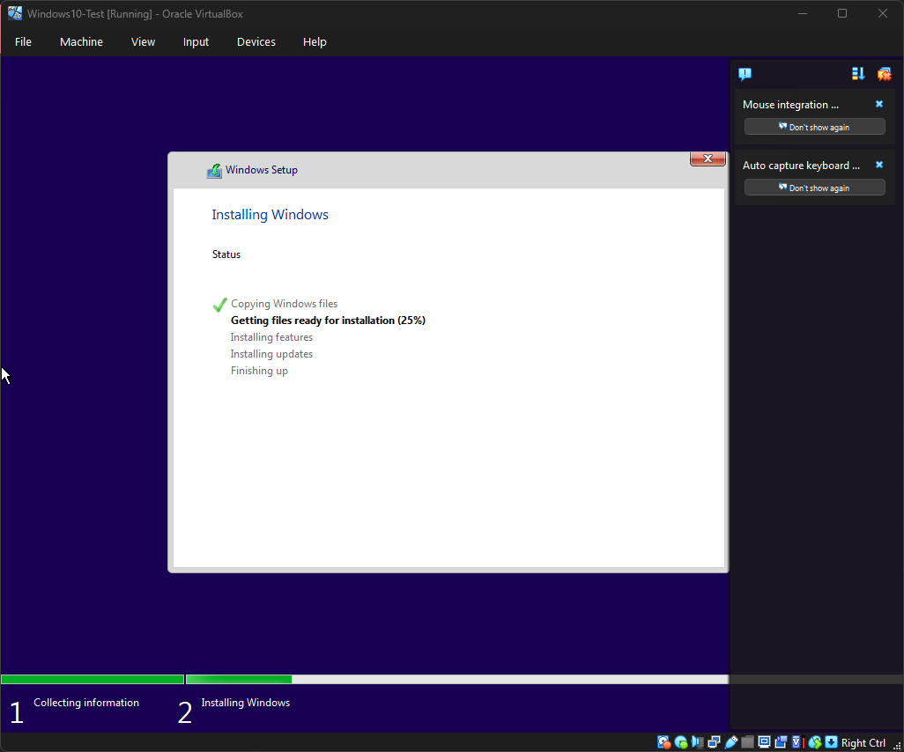
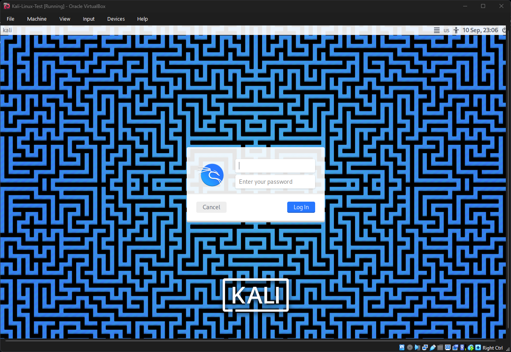

# Lab 1 – Building the Foundational Home Lab Environment

## Objective
To successfully create a self-contained, secure environment for cybersecurity practice by installing and configuring Oracle VirtualBox, a Windows 10 client machine, and a Kali Linux test machine.

## Introduction
A controlled, isolated lab is the first and most critical step for hands-on cybersecurity learning. It provides a safe sandbox to practice techniques, test tools, and make mistakes without impacting real systems.  

This is my **first ever cybersecurity lab as a student**, and it represents the foundation for all my future hands-on learning. By documenting the full process, I can show both my technical progress and my growth as a learner.

## Tools Used
- **Hypervisor:** Oracle VirtualBox 7.2
- **OS Images:**
  - Microsoft Windows 10 (22H2)
  - Kali Linux (2025.2)
- **Host Machine:** Windows 11 Home, Intel i7-12700H, 16 GB RAM, 512 GB SSD

## Methodology

### Phase 1: Hypervisor Preparation
1. Downloaded the latest Oracle VirtualBox installer (`VirtualBox-7.2.0-161176-Win.exe`).
2. Ran the installer with default settings to install VirtualBox and necessary network drivers on the host machine.
3. Verified the installation by launching the VirtualBox Manager interface.

### Phase 2: Virtual Machine Creation
1. **Windows 10 VM:**
    - Name: `Windows 10 - Client`
    - Type: Microsoft Windows
    - Version: Windows 10 (64-bit)
    - Memory: 4096 MB (4 GB)
    - Hard Disk: VDI, Dynamically allocated, **50 GB**
2. **Kali Linux VM:**
    - Name: `Kali Linux - Test`
    - Type: Linux
    - Version: Debian (64-bit)
    - Memory: 4096 MB (4 GB)
    - Hard Disk: VDI, Dynamically allocated, **20 GB**
3. Verified both placeholder VMs were present in the VirtualBox Manager.

### Phase 3: Operating System Installation
1. **Installing Windows 10:**
    - Mounted the Windows 10 ISO (`Win10_22H2_English_x64v1.iso`) to the VM.
    - Booted the VM and followed the graphical installer.
    - Selected "Custom: Install Windows only," and installed to the unallocated space.
    - Created a local user account: `labuser` with password `Lab@1234`.
    - Rebooted into the new Windows 10 desktop.
2. **Installing Kali Linux:**
    - Mounted the Kali Linux ISO to the VM.
    - Initially failed with **"No disk drive detected."**
    - **Fix:** Added `Kali-Linux-Test.vdi` (20 GB) under **Controller: SATA**.
    - Rebooted VM → “Graphical Install.”
    - Used guided partitioning for the entire disk.
    - Selected `Xfce` desktop environment with default tools.
    - Installed GRUB bootloader to `/dev/sda`.
    - Rebooted and logged in as `labuser`.

## Evidence of Success
- **VirtualBox Manager Installed**  
    

- **Placeholder VMs Created**  
    

- **Windows 10 Installation**  
    
    

- **Kali Linux Installation**  
    
    

## Analysis & Observations
- **Resource Allocation:** 4 GB RAM per VM was sufficient for smooth performance on a 16 GB host.  
- **Troubleshooting:** The Kali Linux installer required a virtual hard disk to be explicitly added. Documenting this is useful for future labs and others repeating the setup.  
- **Networking:** NAT networking provided immediate internet access for updates.  
- **Isolation:** Both VMs are isolated from each other and the host, which is the safest initial configuration.

## Conclusion
The foundational home lab environment was built successfully. Two primary operating systems used in cybersecurity, Windows 10 and Kali Linux, are now installed and operational within the isolated VirtualBox environment. This provides a clean, safe platform for all subsequent security labs.  

As my **first student lab**, this project demonstrates not only my ability to set up and troubleshoot a virtualization environment, but also my commitment to learning cybersecurity step by step. It marks the beginning of my hands-on journey.

## Next Steps
This lab enables the next phase of training:
- **Lab 2:** Configuring Host-Only Networking and Establishing VM-to-VM Connectivity.
- **Lab 3:** Conducting Basic Network Reconnaissance with `ping` and `nmap`.

## References
- [Oracle VirtualBox Manual](https://www.virtualbox.org/manual/)  
- [Kali Linux Documentation](https://www.kali.org/docs/)
