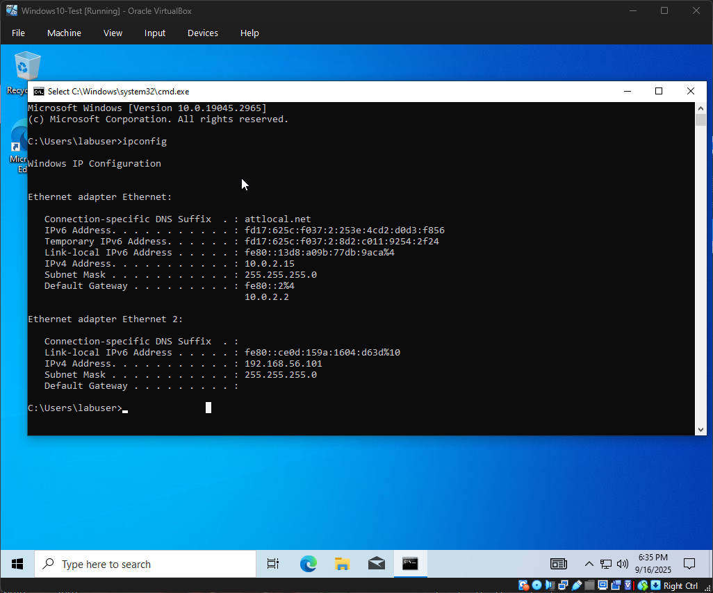
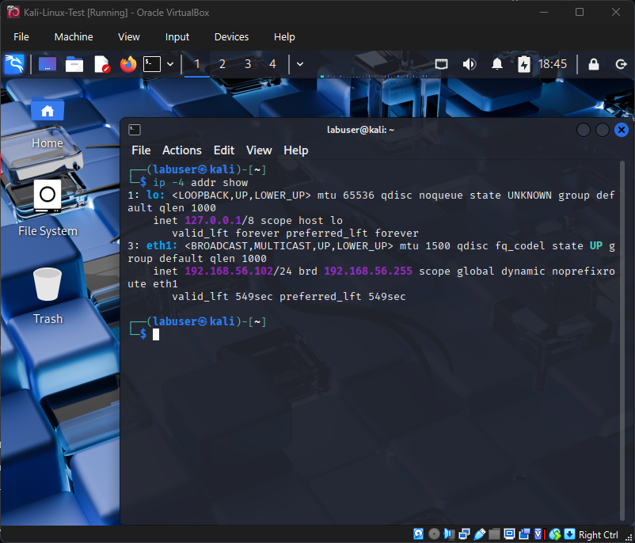

# Lab 2 – VirtualBox Host-Only Networking & VM Connectivity

## Objective
Configure a VirtualBox Host-Only network so Windows 10 and Kali Linux can talk to each other privately while keeping internet access via NAT.

## Introduction
Networking is core to cybersecurity practice. In this lab, I set up NAT + Host-Only networking in VirtualBox, verified IPs on both VMs, and proved connectivity with ping. As a student on my first networking lab, I documented the initial failure and the firewall fix that led to success.

## Tools Used
- Oracle VirtualBox 7.2 (with Extension Pack)
- Windows 10 (22H2) VM
- Kali Linux (2025.2) VM

## Methodology

### Phase 1 — Create Host-Only Adapter (global)
1. Installed the VirtualBox Extension Pack
2. Tools → Network Manager → Create “VirtualBox Host-Only Ethernet Adapter”

📸 Evidence

---

### Phase 2 — Configure each VM (NAT + Host-Only)
- Adapter 1 = NAT (keep internet access)
- Adapter 2 = Host-Only (private VM-to-VM network)

📸 Evidence

---

### Phase 3 — Verify IPs on Host-Only network
- Windows: `ipconfig` shows 192.168.56.x
- Kali: `ip -4 a` shows 192.168.56.x in the same range

📸 Evidence

---

### Phase 4 — Connectivity test (Kali → Windows)
Command (from Kali):
`ping -c 4 192.168.56.101`   (use your Windows host-only IP)

Initial result: fail — “Destination Host Unreachable” (Windows blocks ICMP by default)

📸 Evidence

Fix (Windows Firewall):
Enabled inbound rule: File and Printer Sharing (Echo Request — ICMPv4-In)

📸 Evidence

Retest:
`ping -c 4 192.168.56.101` → success (0% packet loss)

📸 Evidence

---

### (Optional) Phase 5 — Connectivity test (Windows → Kali)
Command (from Windows):
`ping 192.168.56.102`   (use your Kali host-only IP)

Expected: success (Linux allows ICMP by default)

📸 Evidence

---

## Analysis & Observations
- Design: NAT + Host-Only = internet access plus a private lab network (best of both).
- Root cause of failure: Windows Firewall blocked ICMP; enabling the ICMPv4 Echo rule fixed it.
- Security note: Windows defaults are restrictive; Kali defaults are more open — important context for later labs.

## Conclusion
I successfully established isolated VM-to-VM connectivity while keeping internet access. As my first networking lab, this taught both configuration fundamentals and how to reason through a firewall-related failure to a clean fix.

## Next Steps
- Lab 3: Run an initial nmap scan from Kali against the Windows VM and interpret results.
