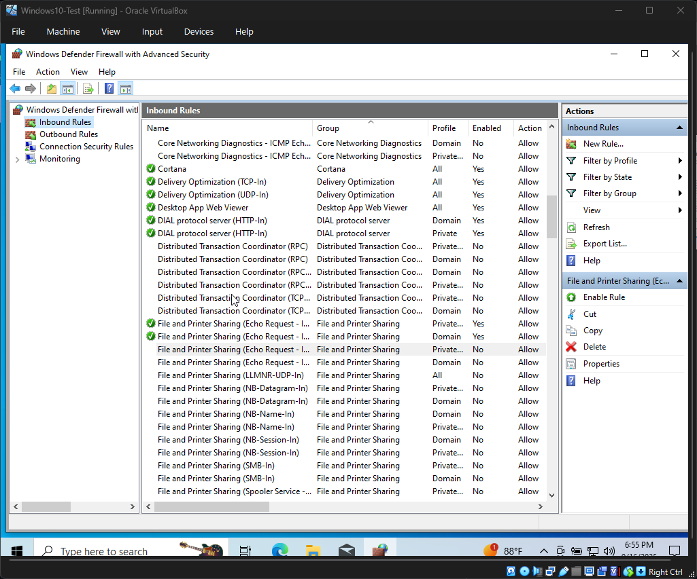

# Lab 2 – VirtualBox Host-Only Networking & VM Connectivity

## Objective
To configure a VirtualBox Host-Only network so Windows 10 and Kali Linux virtual machines can communicate directly with each other while retaining internet access through NAT.

## Introduction
Networking between virtual machines is an essential skill in cybersecurity. This lab demonstrates how to configure both NAT and Host-Only networking in VirtualBox, verify VM IP addresses, and test connectivity using ping.

This is my **first networking lab as a student**, and it represents my first step into configuring and troubleshooting communication between systems in an isolated environment.

## Tools Used
- **Hypervisor:** Oracle VirtualBox 7.2 (with Extension Pack)
- **Operating Systems:**
  - Microsoft Windows 10 (22H2)
  - Kali Linux (2025.2)
- **Host Machine:** Windows 11 Home, Intel i7-12700H, 16 GB RAM, 512 GB SSD

## Methodology

### Phase 1: Host-Only Adapter Creation
1. Installed the VirtualBox Extension Pack.
2. Opened Tools → Network Manager.
3. Created a new Host-Only Adapter (`VirtualBox Host-Only Ethernet Adapter`).
4. Verified that the adapter appeared globally in VirtualBox.

### Phase 2: VM Network Configuration
1. Edited the Windows 10 and Kali Linux VMs.
2. Set Adapter 1 = NAT (internet access).
3. Set Adapter 2 = Host-Only (private VM-to-VM communication).
4. Booted both VMs and confirmed network adapter settings.

### Phase 3: IP Verification
1. On Windows, ran `ipconfig` and noted a Host-Only IP in the range 192.168.56.x.
2. On Kali, ran `ip -4 a` and confirmed an IP in the same subnet.

### Phase 4: Connectivity Test (Kali → Windows)
1. From Kali, attempted to ping the Windows Host-Only IP.
   - Command: `ping -c 4 192.168.56.101`
   - Result: ❌ Failed — Destination Host Unreachable.
2. Identified root cause: Windows Firewall blocks ICMP by default.
3. Fix: Enabled inbound rule **File and Printer Sharing (Echo Request – ICMPv4-In)**.
4. Retested ping: ✅ Success — 0% packet loss.

### Phase 5: Optional Connectivity Test (Windows → Kali)
1. From Windows, pinged Kali’s Host-Only IP.
   - Command: `ping 192.168.56.102`
   - Result: ✅ Success — Linux accepts ICMP by default.

## Evidence of Success
- **Host-Only Adapter Created**
  

- **VMs Configured with Host-Only Adapter**
  
  

- **Host-Only IPs Assigned**
  
  

- **Ping Fail (Before Firewall Fix)**
  

- **Firewall Rule Enabled**
  

- **Ping Success (After Firewall Fix)**
  

- **Optional: Windows → Kali Ping**
  

## Analysis & Observations
- **Design Choice:** NAT + Host-Only gives internet access plus a private network for testing.
- **Troubleshooting:** The main blocker was Windows Firewall; enabling ICMP echo was the key fix.
- **Security Insight:** Windows defaults to blocking ICMP (secure by default), while Kali allows ICMP (open by default).

## Conclusion
This lab successfully established isolated VM-to-VM connectivity while retaining internet access.

As my **first networking lab**, it strengthened my understanding of VirtualBox networking and taught me how to identify and resolve firewall-related issues logically. The lab environment is now ready for network scanning exercises.

## Next Steps
- **Lab 3:** Run an `nmap` scan from Kali against the Windows VM and analyze discovered services.

## References
- [Oracle VirtualBox Manual](https://www.virtualbox.org/manual/)
- [Microsoft Docs – Windows Defender Firewall](https://learn.microsoft.com/en-us/windows/security/threat-protection/windows-firewall/)
- [Kali Linux Documentation](https://www.kali.org/docs/)
