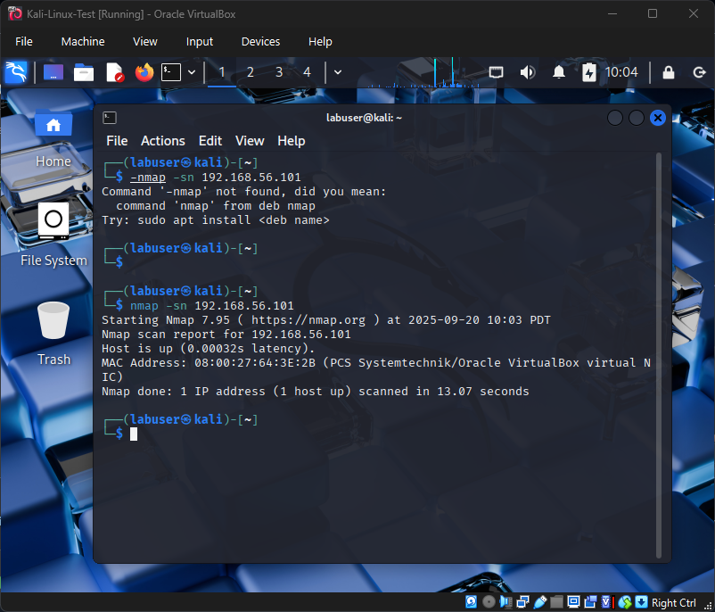

# Lab 3 – First Network Scan with Nmap

## Objective
To perform a basic network scan from Kali Linux against the Windows 10 VM using nmap, verifying connectivity and identifying open services.

## Introduction
Network scanning is a fundamental skill in cybersecurity. This lab demonstrates the use of nmap for host discovery and service detection in a safe, isolated lab environment.

As a student building my first scanning lab, this exercise helps me understand how attackers and defenders map systems on a network.

## Tools Used
- **Kali Linux (2025.2)** with nmap
- **Windows 10 (22H2)** as the scan target
- **VirtualBox Host-Only Network** (192.168.56.0/24)

## Methodology

### Phase 1: Identify Windows Host-Only IP
- On Windows VM, ran `ipconfig`.
- Host-Only IP: `192.168.56.101`.

### Phase 2: Run Host Discovery (Ping Scan)
- On Kali VM, ran:
  `nmap -sn 192.168.56.101`
- Result: Host is up.

📸 Evidence:

### Phase 3: Run Service & Version Detection
- On Kali VM, ran:
  `nmap -sV 192.168.56.101`
- Result: All 1000 TCP ports filtered (Windows Firewall blocked responses).

📸 Evidence:

## Evidence of Success
- Nmap confirmed Windows VM is online and reachable.
- Service detection scan returned filtered ports, consistent with Windows Firewall defaults.

## Analysis & Observations
- Connectivity verified — Windows responded to host discovery.
- Service scan returned only filtered ports, showing Windows Firewall is blocking probes.
- Security Insight: A default Windows 10 system is not openly exposing services, demonstrating secure-by-default configurations.

## Conclusion
This lab successfully used nmap from Kali to discover the Windows 10 VM and attempt service enumeration. The lack of open ports highlights how firewalls protect systems from reconnaissance.

As my first scanning lab, it bridges connectivity (Lab 2) and network reconnaissance.

## Next Steps
- **Lab 4 (optional):** Explore what happens when services are manually enabled (e.g., enabling SMB or RDP).
- Build guides for common scanning techniques.

## References
- [Nmap Reference Guide](https://nmap.org/book/man.html)
- [Kali Linux Documentation](https://www.kali.org/docs/)
