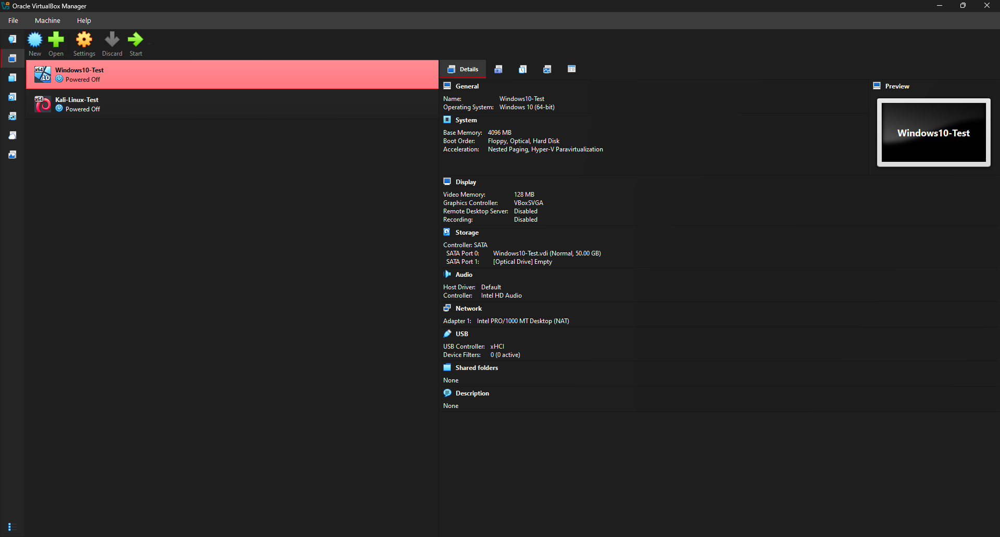
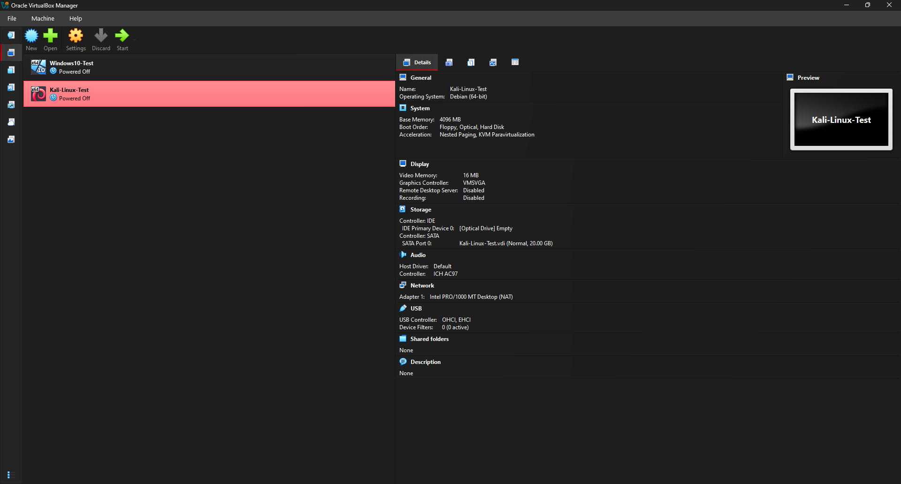
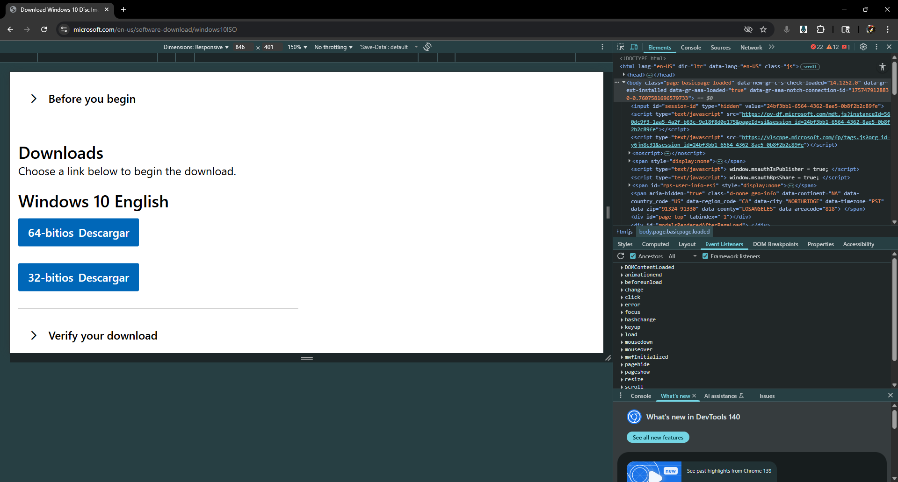
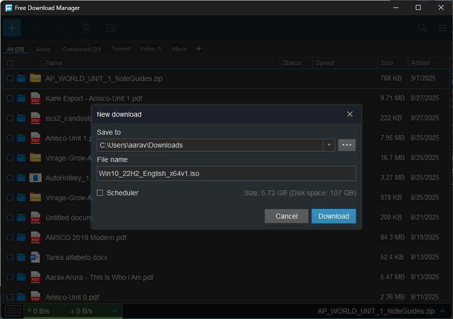

# Day 2 Notes

## Goal
Install Windows 10 and Kali Linux fully in VirtualBox.

---

## Pre-flight Checklist
- ISOs available locally (Windows 10, Kali Linux)
- VM resources sized (RAM/CPU/disk)
- Network mode set (start with NAT)

## Pre-flight Screenshots
  
  

---

## Windows 10 ISO

- Downloaded **Windows 10 ISO (Win10_22H2_English_x64v1.iso)**  
- File size: **5.72 GB**  
- Saved to: **C:\ISOs\Win10_22H2_English_x64v1.iso**  

### ISO Screenshots
  
  

---

## Next Steps
- Mount Windows 10 ISO in VirtualBox  
- Install Windows 10 fully and take desktop screenshot  
- Mount Kali Linux ISO in VirtualBox  
- Install Kali Linux fully and take desktop screenshot  
- Document installation steps and results
