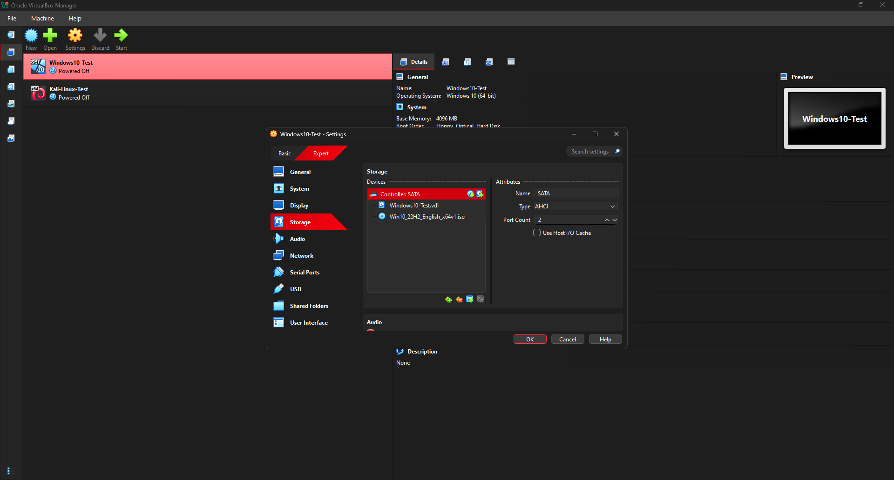

# Day 2 Notes

## Goal
Install Windows 10 fully in VirtualBox.

---

## Pre-flight Checklist
- ISOs available locally (Windows 10 ISO downloaded, Kali Linux pending for Day 3)
- VM resources sized (RAM/CPU/disk)
- Network mode set (NAT)

## Pre-flight Screenshots
  
  

---

## Windows 10 ISO

- Downloaded **Windows 10 ISO (Win10_22H2_English_x64v1.iso)**  
- File size: **5.72 GB**  
- Saved to: **C:\ISOs\Win10_22H2_English_x64v1.iso**  

### ISO Screenshots
  
  

---

## Windows 10 Installation

- Mounted ISO in VirtualBox (Storage → Optical Drive)  
- Selected **Custom Installation** on empty 50 GB disk  
- Skipped product key (unactivated install)  
- Created local account: `labuser` / `Lab@1234`  
- Used simple answers (`cyberlab`) for all security questions  
- Windows 10 installed successfully and booted to desktop  

### Installation Screenshots
  
  
  

---

## Next Steps
- Install Kali Linux fully (Day 3)  
- Document networking modes (NAT, Bridged, Host-Only)  
- Test connectivity between Windows 10 and Kali VMs  
