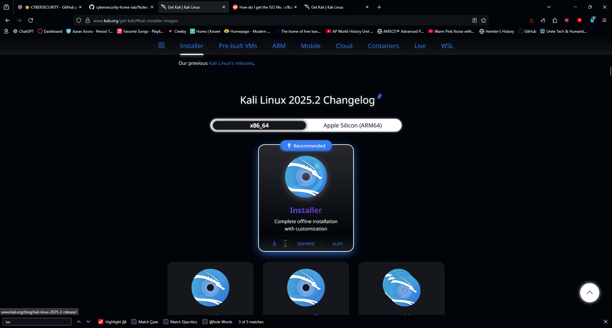
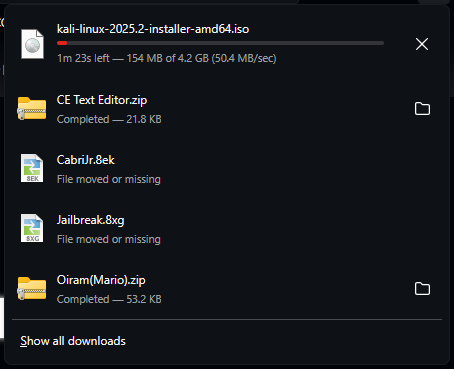

# Day 3 Notes

## Goal
Install Kali Linux fully in VirtualBox.

---

## Pre-flight Checklist
- Kali Linux ISO downloaded from official site (https://www.kali.org/get-kali/#kali-platforms)
- VM resources sized (RAM/CPU/disk)
- Network mode set (NAT)

---

## Kali Linux ISO

- Downloaded **Kali Linux ISO (kali-linux-2025.2-installer-amd64.iso)**  
- File size: ~4.2 GB  
- Saved to: **C:\ISOs\kali-linux-2025.2-installer-amd64.iso**  

### ISO Screenshots
  
  

---

## Next Steps
- Mount Kali ISO in VirtualBox (Storage → Optical Drive)  
- Begin installation process (Custom Install on 20 GB disk)  
- Create lab user account for Kali  
- Capture screenshots of install start and desktop after install  
