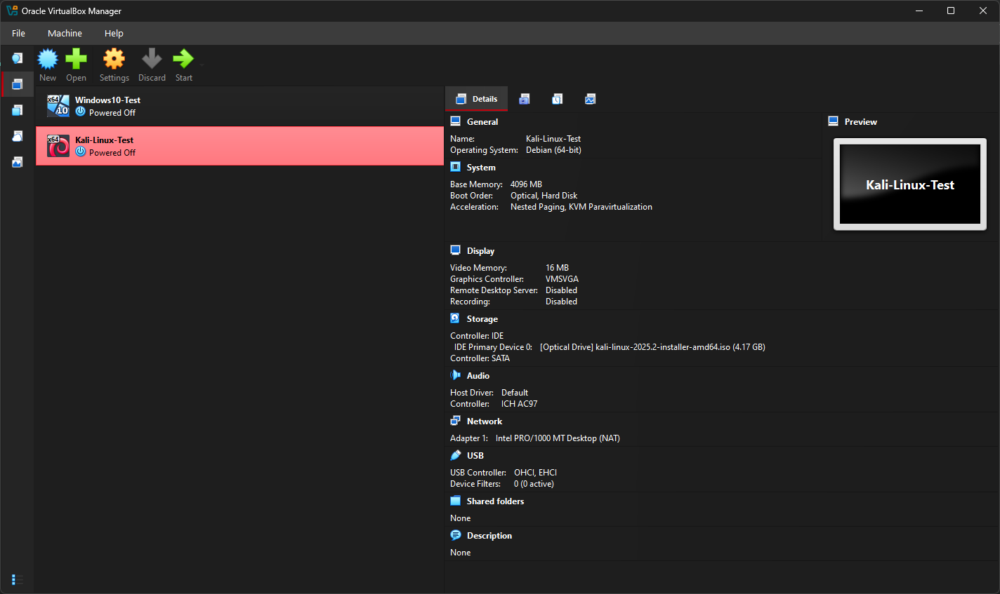
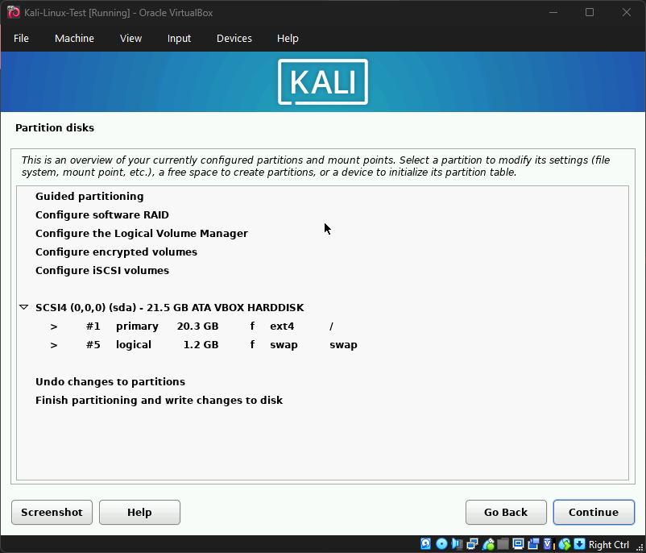

# Day 3 Notes – Kali Linux Installation

## Setup Summary
- Mounted Kali Linux ISO (`kali-linux-2025.2-installer-amd64.iso`)  
- Fixed missing disk issue by adding a 20GB VDI to VM storage  
- Booted into **Graphical Install** and completed full setup  

---

## Fix Applied
- Issue: Installer reported *“No disk drive detected”*  
- Solution: Added virtual hard disk (`Kali-Linux-Test.vdi`, 20GB) under SATA controller  

---

## Installation Steps
1. Booted with mounted ISO  
     

2. Partitioning  
   - Guided – use entire disk  
   - All files in one partition  
   - Confirmed changes written to disk  
     

3. Software Selection  
   - Desktop Environment: **Xfce**  
   - Tools: **top10** and **default** recommended tools  

4. GRUB Bootloader  
   - Installed to `/dev/sda`  

5. First Boot  
   - Logged in with:  
     - Username: `labuser`  
     - Password: `Lab@1234`  

---

## Observations
- Xfce desktop environment runs smoothly under VirtualBox  
- Networking works under NAT mode (internet accessible)  
- Both Windows 10 and Kali Linux VMs are now ready for lab use  

---

## Next Steps (Day 4)
- Configure VirtualBox networking (NAT, Bridged, Host-Only)  
- Enable shared folders between host and VMs  
- Take initial networking screenshots and document setup  
