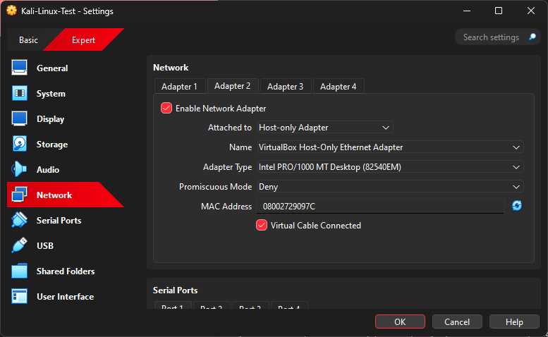
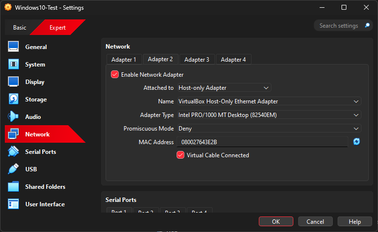

# Day 5a - Host-Only Network Adapter Setup (2025-09-15)

## Goal
Configure both the Kali Linux VM and the Windows 10 VM with an additional Host-Only Adapter.  
This will allow direct communication between the two VMs without using the internet.

---

## Steps Taken

### 1. Created Host-Only Adapter in VirtualBox
- Opened **File → Tools → Network Manager** in VirtualBox.
- Created a new Host-only Adapter (`VirtualBox Host-Only Ethernet Adapter`) with default IP range `192.168.56.1/24`.
- Verified it appeared correctly in the Network Manager.

📸 *Screenshot Evidence:*  

---

### 2. Configured Kali VM
- Opened **Settings → Network → Adapter 2**.
- Enabled Adapter, set **Attached to: Host-only Adapter**.
- Selected `VirtualBox Host-Only Ethernet Adapter`.
- Left Adapter 1 as **NAT** (for internet access).
- Saved changes.

📸 *Screenshot Evidence:*  

---

### 3. Configured Windows VM
- Opened **Settings → Network → Adapter 2**.
- Enabled Adapter, set **Attached to: Host-only Adapter**.
- Selected `VirtualBox Host-Only Ethernet Adapter`.
- Left Adapter 1 as **NAT** (for internet access).
- Saved changes.

📸 *Screenshot Evidence:*  

---

## Outcome
- Both VMs now have:
  - **Adapter 1 (NAT):** Internet access.
  - **Adapter 2 (Host-only):** Internal network for VM-to-VM communication.
- This prepares the environment for **Day 5b testing** (pinging between machines and running nmap).

---

## Next Step
On **Day 5b**, we will:
- Boot both VMs.
- Run `ipconfig` (Windows) and `ip addr` (Kali) to confirm IPs.
- Test connectivity with `ping`.
- Run an initial `nmap` scan from Kali to Windows.
