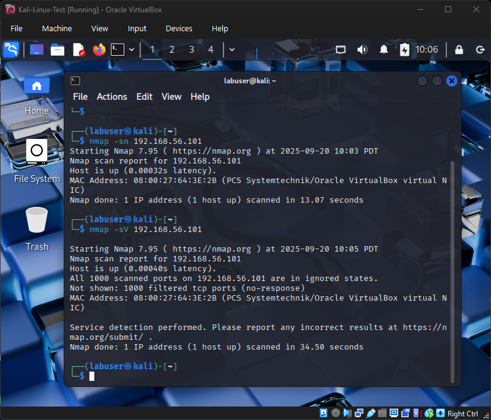

# Day 7 – Lab 3: First Nmap Scan (2025-09-20)

## Goal
Perform initial network reconnaissance from Kali Linux against the Windows 10 VM using **nmap** to practice host discovery and service/version detection.

---

## Steps Taken

### 1. Verified Windows Host-Only IP
- Booted Windows 10 VM.  
- Ran `ipconfig` → Host-Only IP confirmed as `192.168.56.101`.  

---

### 2. Nmap Host Discovery Scan
- From Kali Linux, ran:  
  `nmap -sn 192.168.56.101`  
- ✅ Result: Host detected and responding to probes.  

📸 *Screenshot Evidence:*  
  

---

### 3. Nmap Service & Version Detection
- Ran deeper scan to detect open ports and running services:  
  `nmap -sV 192.168.56.101`  
- ❌ Result: All scanned ports reported as **filtered**.  
- Explanation: Windows Firewall blocks most inbound connections by default.  

📸 *Screenshot Evidence:*  
  

---

## Outcome
- Successfully confirmed that the Windows host is **reachable on the network**.  
- Learned that a default Windows 10 system appears **secure-by-default**, with services hidden behind the firewall.  
- This sets the stage for later labs involving firewall configuration, service exposure, and targeted exploitation.  

---
