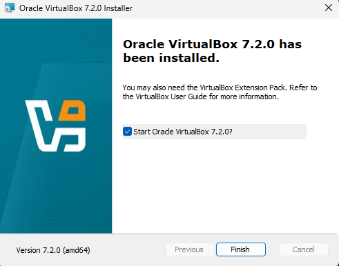
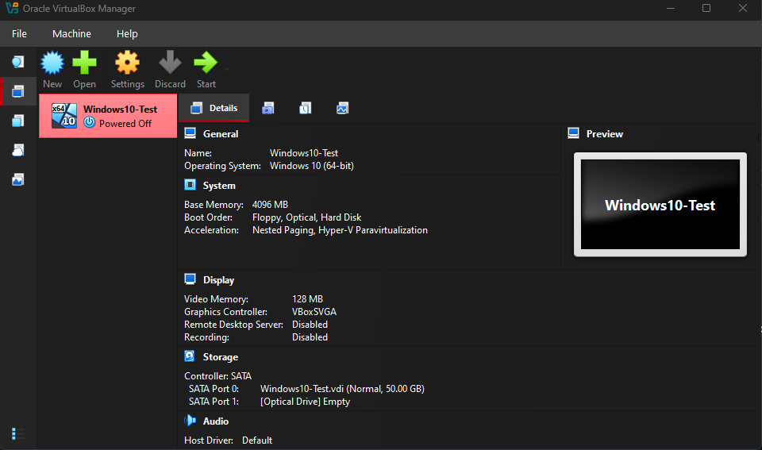
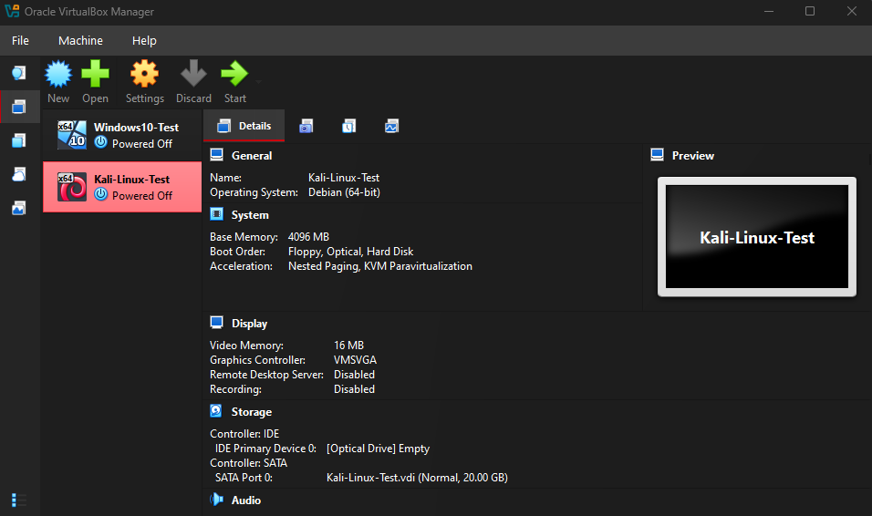
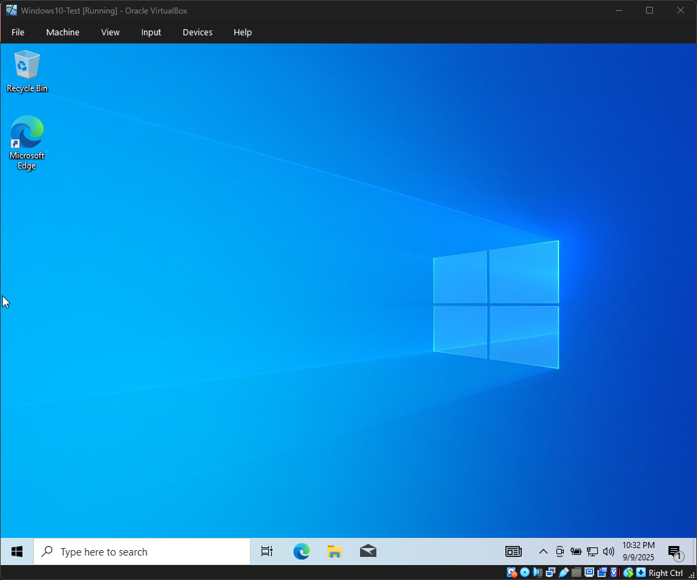

# Home Lab Setup

**Purpose:**  
This is my foundational cybersecurity lab for hands-on learning. It includes virtual machines running **Windows 10** and **Kali Linux** on **VirtualBox**.

**Why This Lab:**  
- Safe environment to practice IT & cybersecurity exercises  
- Supports learning for **CompTIA Tech+**, **A+**, **Google Cybersecurity Certificate**, and **TryHackMe** labs  
- Builds a professional portfolio for college applications and internships  

---

## Current Progress (Day 1)
- VirtualBox installed ✅  
    

- Placeholder Windows 10 VM created ✅  
    

- Placeholder Kali Linux VM created ✅  
    

📑 [Day 1 Notes](Notes/Day1.md)

---

## Current Progress (Day 2)
- Windows 10 installed successfully ✅  
  

📑 [Day 2 Notes](Notes/Day2.md)

---

## Repository Structure
- **/Screenshots** → All VM setup screenshots  
- **/Notes** → Daily lab notes  
- **README.md** → Roadmap + progress tracker (this file)  

---

## Planned Next Steps
- Install Kali Linux fully (Day 3) and capture screenshots  
- Document networking modes (NAT, Bridged, Host-Only)  
- Test connectivity between Windows 10 and Kali VMs  
- Continue expanding lab documentation
