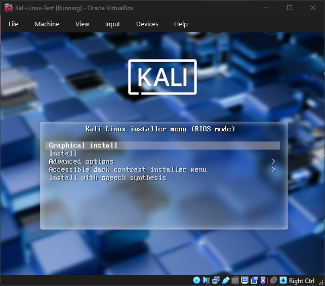
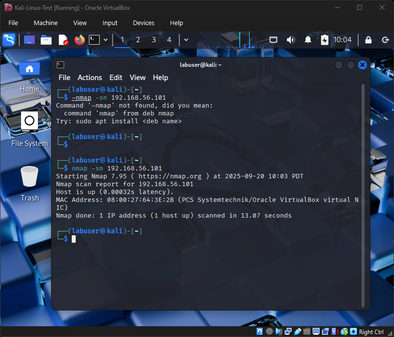
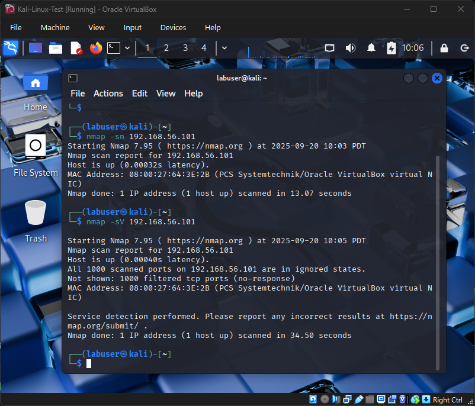

# Cybersecurity Home Lab

> 📘 **Note:**  
> This repository documents my **step-by-step learning journey** in building a cybersecurity home lab.  
> It includes both **daily notes** (what I tried, what broke, how I fixed it) and **polished lab reports** (formal write-ups with results and conclusions).  
> The goal is to show not just what I accomplished, but **how I learned and solved problems along the way**.

**Purpose:**  
This is my foundational cybersecurity lab for hands-on learning. It includes virtual machines running **Windows 10** and **Kali Linux** on **VirtualBox**.

**Why This Lab:**  
- Safe environment to practice IT & cybersecurity exercises  
- Supports learning for **CompTIA Tech+**, **A+**, **Google Cybersecurity Certificate**, and **TryHackMe** labs  
- Builds a professional portfolio for college applications and internships  

---

## Current Progress

### ✅ Day 1 – Initial Setup (2025-09-08)
- Installed VirtualBox  
- Created placeholder VMs for Windows 10 and Kali Linux  

📸 Evidence:  
  
  
  

---

### ✅ Day 2 – Windows 10 Installation (2025-09-09)
- Installed Windows 10 in the VM  
- Created a local account (`labuser`) using bypass trick  
- Captured setup screenshots  

📸 Evidence:  
  
  

---

### ✅ Day 3 – Kali Linux Installation (2025-09-10)
- Created 20GB virtual disk and installed Kali Linux  
- Used Guided Partitioning  
- Booted into fresh Kali environment  

📸 Evidence:  
  
  
  

---

### ✅ Day 4 – Repo Structure & Docs (2025-09-11)
- Added `/Labs` for polished writeups  
- Added `/Guides` for tutorials  
- Added `TROUBLESHOOTING.md` and `RESOURCES.md`  
- Logged first troubleshooting entries  

---

### ✅ Day 5a – Host-Only Adapter Setup (2025-09-15)
- Installed VirtualBox Extension Pack  
- Created a new Host-only Adapter (`VirtualBox Host-Only Ethernet Adapter`)  
- Configured **Adapter 2 → Host-only** on both Windows and Kali VMs  
- Verified configurations via screenshots  

📸 Evidence:  
  
  
  

---

### ✅ Day 5b – VM Connectivity Test (2025-09-16)
- Found Windows Host-only IP using `ipconfig`  
- Ping from Kali → Windows initially failed (ICMP blocked)  
- Enabled Windows Firewall inbound rule: **File and Printer Sharing (Echo Request – ICMPv4-In)**  
- Retested → Successful ping 🎉  

📸 Evidence:  
  
  
  

---

### ✅ Day 6 – Lab 2: Networking & Connectivity (2025-09-19)
- Configured Host-Only networking alongside NAT.
- Verified Windows + Kali received IPs in the 192.168.56.x subnet.
- Initial Kali → Windows ping failed (ICMP blocked).
- Fixed by enabling Windows Firewall rule (Echo Request – ICMPv4-In).
- Retested → success. Also confirmed optional Windows → Kali ping.

📸 Evidence:

---

### ✅ Day 7 – Lab 3: Nmap Scan (2025-09-20)
- Verified Windows Host-Only IP using ipconfig.
- From Kali, ran nmap host discovery and service/version detection scans.
- Host responded, but service scan showed all ports filtered (Windows Firewall blocking).
- This confirmed connectivity and demonstrated secure-by-default Windows settings.

📸 Evidence:

