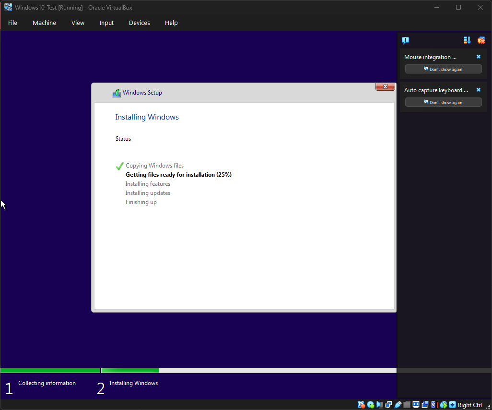

# Home Lab Setup

**Purpose:**  
This is my foundational cybersecurity lab for hands-on learning. It includes virtual machines running **Windows 10** and **Kali Linux** on **VirtualBox**.

**Why This Lab:**  
- Safe environment to practice IT & cybersecurity exercises  
- Supports learning for **CompTIA Tech+**, **A+**, **Google Cybersecurity Certificate**, and **TryHackMe** labs  
- Builds a professional portfolio for college applications and internships  

---

## Current Progress

### ✅ Day 1 – Initial Setup (2025-09-08)
- Installed VirtualBox.  
- Created placeholder VMs for Windows 10 and Kali Linux.  

📸 Evidence:  
  
  
  

---

### ✅ Day 2 – Windows 10 Installation (2025-09-09)
- Installed Windows 10 in the VM.  
- Created a local account (`labuser`) using bypass trick.  
- Captured setup screenshots.  

📸 Evidence:  
  
  

---

### ✅ Day 3 – Kali Linux Installation (2025-09-10)
- Created 20GB virtual disk and installed Kali Linux.  
- Used Guided Partitioning.  
- Booted into fresh Kali environment.  

📸 Evidence:  
  
  

---

### ✅ Day 4 – Repo Structure & Docs (2025-09-11)
- Added `/Labs` for polished writeups.  
- Added `/Guides` for tutorials.  
- Added `TROUBLESHOOTING.md` and `RESOURCES.md`.  
- Logged first troubleshooting entries.  

---

### ✅ Day 5a – Host-Only Adapter Setup (2025-09-15)
- Installed VirtualBox Extension Pack.  
- Created a new Host-only Adapter (`VirtualBox Host-Only Ethernet Adapter`).  
- Configured **Adapter 2 → Host-only** on both Windows and Kali.  
- Verified network settings via screenshots.  

📸 Evidence:  
  
  
  

---

## Repository Structure
- **/Screenshots** → All VM setup screenshots  
- **/Notes** → Daily notes (Day 1 → Day 5a so far)  
- **/Labs** → Polished single-topic reports  
- **/Guides** → How-to tutorials for VirtualBox and tools  
- **README.md** → Roadmap + progress tracker  
- **TROUBLESHOOTING.md** → Running log of issues and fixes  
- **RESOURCES.md** → Reliable links and references  
