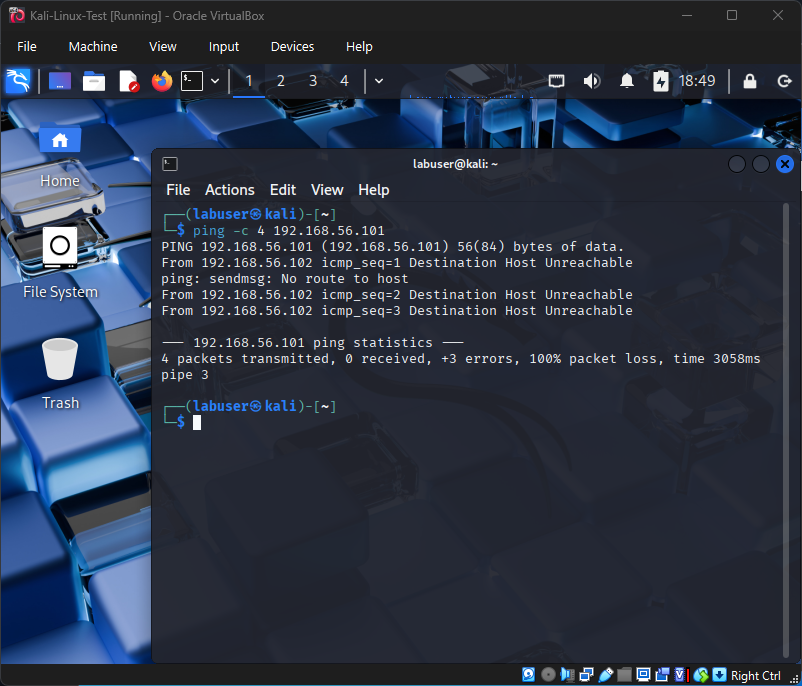
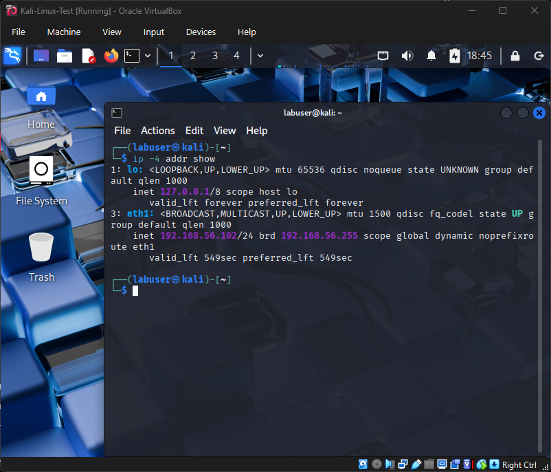

# Cybersecurity Home Lab

## Highlights
This is my first fully documented cybersecurity home lab, built from scratch using Oracle VirtualBox.  
It demonstrates that I can install and configure virtual machines, set up isolated networking, troubleshoot connectivity issues, and perform basic reconnaissance scans with nmap.  

By combining **daily notes**, **polished lab reports**, **guides**, and **troubleshooting logs**, this repo shows not only what I accomplished but also **how I learned, solved problems, and documented professionally**.  
It is designed to be both a **learning project** and a **portfolio piece** for college applications, internships, and future cybersecurity roles.  

---

## Purpose
- Provide a **safe, isolated environment** to practice IT and cybersecurity techniques.  
- Support preparation for certifications like **CompTIA ITF+, A+, Security+**, and the **Google Cybersecurity Certificate**.  
- Build an evidence-based portfolio with **screenshots, labs, and troubleshooting logs**.  

---

## Repo Structure
- `/Notes/` — Day-by-day notes (raw learning logs).  
- `/Labs/` — Polished reports (formal write-ups with objectives, steps, outcomes).  
- `/Guides/` — How-to documentation (repeatable instructions, e.g. snapshots).  
- `/Screenshots/` — Evidence files (all PNGs with action + date in filename).  
- `README.md` — Project overview + portfolio summary.  
- `TROUBLESHOOTING.md` — Symptom → Cause → Fix → Evidence (dated).  
- `RESOURCES.md` — Official references and documentation links.  

---

## Labs Completed
- [Lab 1 – Building the Foundational Home Lab Environment](Labs/Lab_1_Foundation.md)  
- [Lab 2 – VirtualBox Host-Only Networking & VM Connectivity](Labs/Lab_2_Network_Config.md)  
- [Lab 3 – First Network Scan with Nmap](Labs/Lab_3_Nmap_Scan.md)  

---

## Current Progress

### ✅ Day 1 – Initial Setup (2025-09-08)
- Installed VirtualBox  
- Created placeholder VMs for Windows 10 and Kali Linux  

📸 Evidence:  
  
  
  

---

### ✅ Day 2 – Windows 10 Installation (2025-09-09)
- Installed Windows 10 in the VM  
- Created a local account (`labuser`) using bypass trick  

📸 Evidence:  
  
  
  

---

### ✅ Day 3 – Kali Linux Installation (2025-09-10)
- Added a 20GB virtual hard disk  
- Installed Kali Linux with XFCE desktop environment and default tools  

📸 Evidence:  
  
  
  

---

### ✅ Day 4 – Repo Structure & Docs (2025-09-11)
- Added `/Labs` and `/Guides` folders  
- Created `TROUBLESHOOTING.md` and `RESOURCES.md`  
- Logged first troubleshooting entries  

---

### ✅ Day 5a – Host-Only Adapter Setup (2025-09-15)
- Installed VirtualBox Extension Pack  
- Created Host-Only Adapter in Network Manager  
- Configured Adapter 2 = Host-Only on both VMs  

📸 Evidence:  
  
  
  

---

### ✅ Day 5b – VM Connectivity Test (2025-09-16)
- Found Windows Host-Only IP with `ipconfig`  
- Kali → Windows ping initially failed (ICMP blocked)  
- Enabled Windows Firewall inbound ICMP rule  
- Retested → ping successful  

📸 Evidence:  
  
  
  

---

### ✅ Day 6 – Lab 2: Networking & Connectivity (2025-09-19)
- Configured Host-Only networking alongside NAT  
- Verified both VMs received IPs in the 192.168.56.x subnet  
- Kali → Windows ping fixed by enabling firewall rule  
- Verified bidirectional communication  
- Produced Lab 2 polished write-up  

📸 Evidence:  
  
  

---

### ✅ Day 7 – Lab 3: Nmap Scan (2025-09-20)
- Verified Windows Host-Only IP  
- From Kali, ran nmap host discovery and service/version scans  
- Host responded, but service scan showed all ports filtered (Windows Firewall blocking)  
- Demonstrated connectivity and secure-by-default Windows settings  

📸 Evidence:  
  
  

---

## Troubleshooting Highlights
Examples of issues solved:  
- Windows 10 OOBE forced Microsoft account → bypassed with `OOBE\BYPASSNRO`  
- Kali Linux “No disk drive found” → fixed by adding a virtual hard disk  
- Missing Host-Only Adapter option → fixed by creating adapter in VirtualBox Network Manager  
- Kali → Windows ping failed → fixed by enabling Windows Firewall ICMP rule  
- Nmap service scan showed all ports filtered → explained by Windows Firewall defaults  

---

## Next Steps
- Add a third VM (Ubuntu server or Metasploitable) for advanced labs  
- Document TryHackMe practice labs in a separate repo  
- Begin certification-focused repos (CompTIA ITF+, A+)  

## Part of Larger Journey

**Full Portfolio:** [Cybersecurity-Portfolio-Hub](https://github.com/AaravArora3835/Cybersecurity-Portfolio-Hub)

**Related Projects:**
- [SecureScholar Platform](https://github.com/AaravArora3835/SecureScholar-Platform) — Gamified cybersecurity learning platform  
- [Google Cybersecurity Certificate](https://github.com/AaravArora3835/Google-Cybersecurity-Certificate) — Foundational certification journey  

---

## References
- [Oracle VirtualBox Manual](https://www.virtualbox.org/manual/)  
- [Kali Linux Documentation](https://www.kali.org/docs/)  
- [Nmap Reference Guide](https://nmap.org/book/man.html)  
