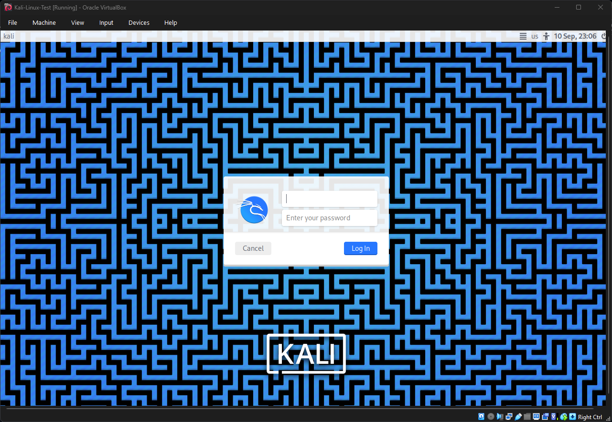

# Home Lab Setup

**Purpose:**  
This is my foundational cybersecurity lab for hands-on learning. It includes virtual machines running **Windows 10** and **Kali Linux** on **VirtualBox**.

**Why This Lab:**  
- Safe environment to practice IT & cybersecurity exercises  
- Supports learning for **CompTIA Tech+**, **A+**, **Google Cybersecurity Certificate**, and **TryHackMe** labs  
- Builds a professional portfolio for college applications and internships  

---

## Current Progress

### ✅ Day 1 – VirtualBox + Placeholders
- VirtualBox installed  
    
- Placeholder Windows 10 VM created  
    
- Placeholder Kali Linux VM created  
    

---

### ✅ Day 2 – Windows 10 Installation
- Mounted Windows 10 ISO  
    
- Windows 10 installation in progress  
    
- Windows 10 fully installed with lab user  
    

---

### ✅ Day 3 – Kali Linux Installation
- Fixed storage issue (added 20GB VDI)  
    
- Mounted Kali ISO  
    
- Partitioning confirmed  
    
- Kali installed successfully and booted into desktop  
    

---

## Repository Structure
- **/Screenshots** → All VM setup screenshots  
- **/Notes** → Daily lab notes (Day 1, Day 2, Day 3, …)  
- **README.md** → Roadmap + progress tracker (this file)  
