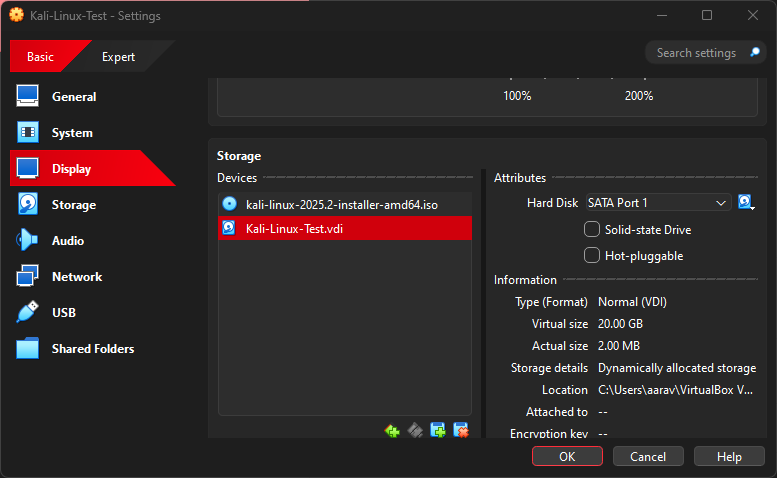
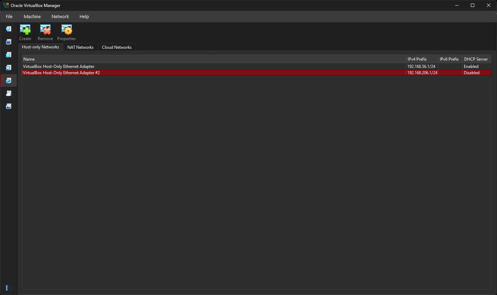
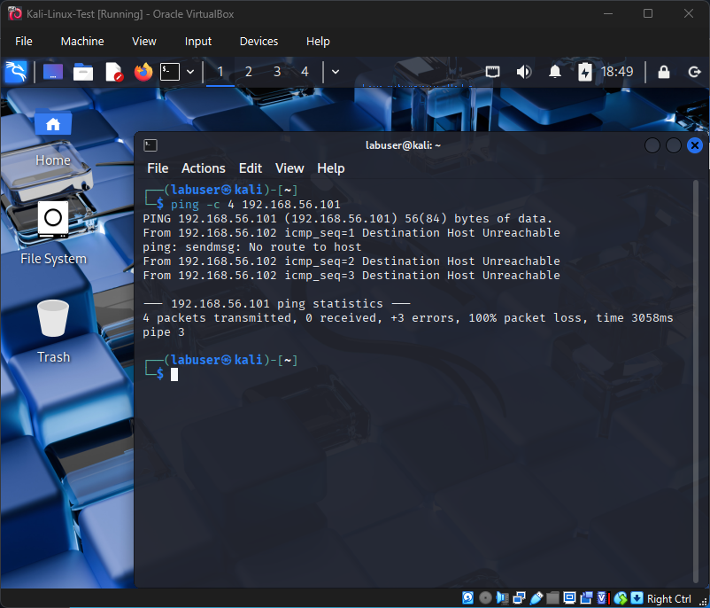
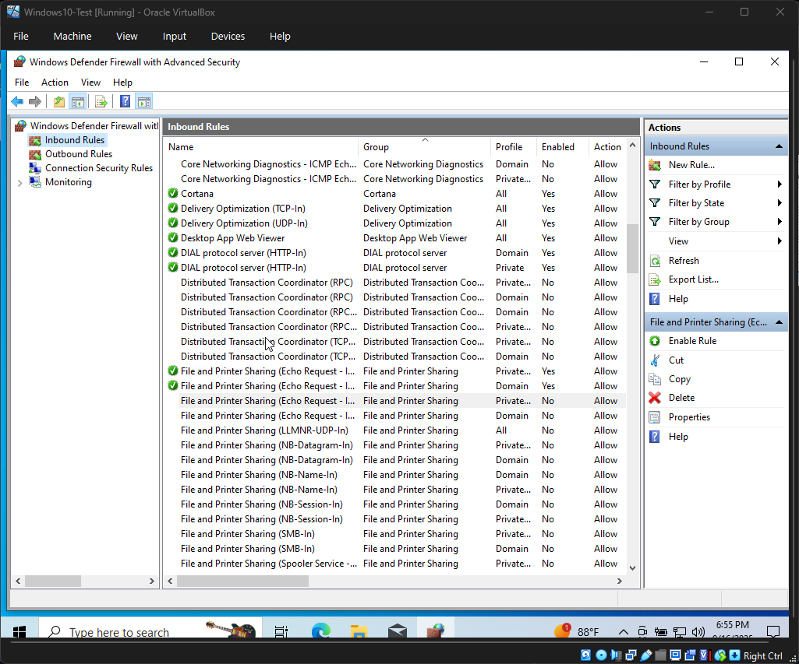
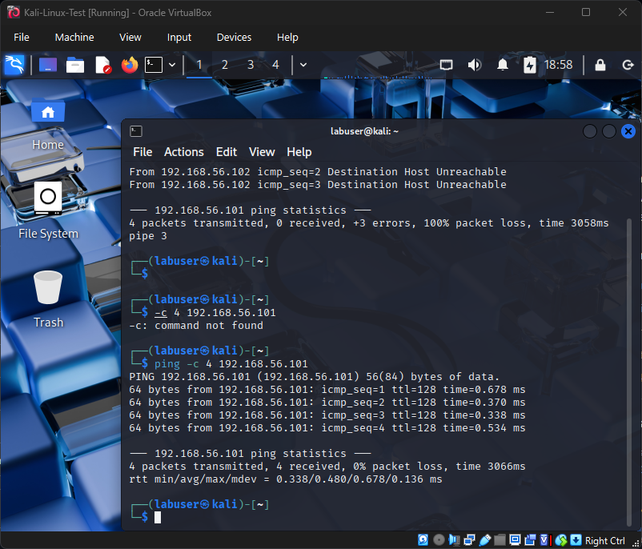

# TROUBLESHOOTING

A running log of issues and fixes encountered in the home lab.

---

## 2025-09-09 – Windows 10 forced Microsoft account
**Symptom:** OOBE required Microsoft account, no offline option  

**Fixes tried:**  
- Fake email trick → inconsistent in 22H2  
- ✅ **Solved:** `Shift + F10` → `OOBE\BYPASSNRO` (reboot) → “I don’t have Internet” → local account  
- Alt method: disable VM network adapter, then continue with limited setup  

---

## 2025-09-10 – Kali “No disk drive was detected”
**Symptom:** Installer couldn’t see any disk  

**Root Cause:** VM had no virtual hard disk attached (only ISO)  

**Fix:**  
- Added new **VDI** (20 GB) under **SATA**  
- Booted installer again → disk detected → guided partition OK  

📸 *Evidence:*  

---

## 2025-09-15 – Missing Host-Only Adapter Option
**Symptom:** In VM → Settings → Network, only Adapter 1 visible. No option to attach Host-only adapter.  

**Root Cause:** On VirtualBox 7.x, Host-only adapters must be created globally first.  

**Fix:**  
1. Installed VirtualBox Extension Pack  
2. Navigated to **File → Tools → Network Manager**  
3. Created new Host-only Adapter (`VirtualBox Host-Only Ethernet Adapter`)  
4. Adapter then appeared under VM → Settings → Network → Adapter 2  

📸 *Evidence:*  

---

## 2025-09-16 – Kali → Windows ping fails
**Symptom:**  
`ping -c 4 192.168.56.101` returned **Destination Host Unreachable** from Kali.  

**Cause:** Windows Defender Firewall blocked ICMP echo requests by default.  

**Fix:**  
- Enabled inbound rule: **File and Printer Sharing (Echo Request – ICMPv4-In)**  
- Retested from Kali → ping succeeded (0% packet loss).  

📸 *Evidence:*  
  
  

---

## 2025-09-19 – Kali → Windows ping blocked
**Symptom:** Ping from Kali to Windows failed (Destination Host Unreachable).  
**Root Cause:** Windows Firewall blocked ICMP echo requests.  
**Fix:** Enabled inbound rule: File and Printer Sharing (Echo Request – ICMPv4-In).  
**Evidence:**  
  
  

