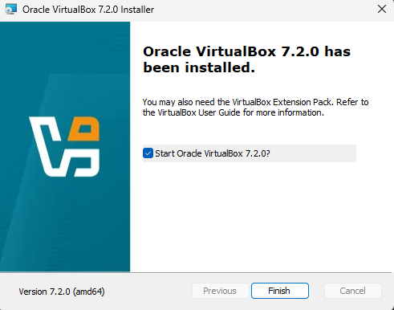
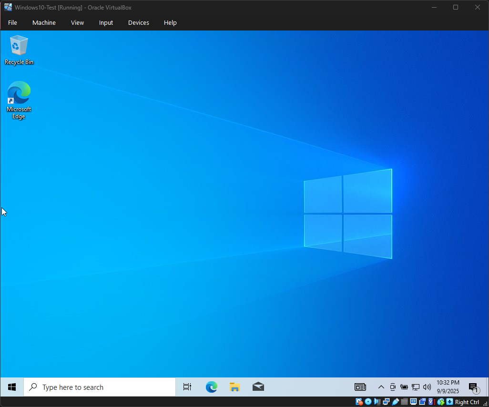

# Lab 1 – Initial Setup

## Goal
Document how the home lab environment was created using VirtualBox, Windows 10, and Kali Linux.

---

## Steps Taken
1. Installed VirtualBox (Day 1)  
2. Created placeholder VMs for Windows 10 and Kali Linux (Day 1)  
3. Downloaded official ISOs (Windows 10 – Day 2, Kali – Day 3)  
4. Installed Windows 10 (Day 2)  
5. Installed Kali Linux (Day 3)  

---

## Evidence

### VirtualBox Installation
  

### Placeholder VMs
  
  

### Windows 10 Install
  
  
  

### Kali Linux Install
  
  
  
  

---

## Observations
- VirtualBox runs smoothly with 4 GB RAM per VM  
- Networking defaults to NAT and provides internet access out-of-the-box  
- Documentation with screenshots helps catch misconfigurations quickly (example: Kali disk detection issue)  

---

## Next Steps
- Configure VM-to-VM networking  
- Document connectivity tests (ping, nmap) in **Lab 2**
